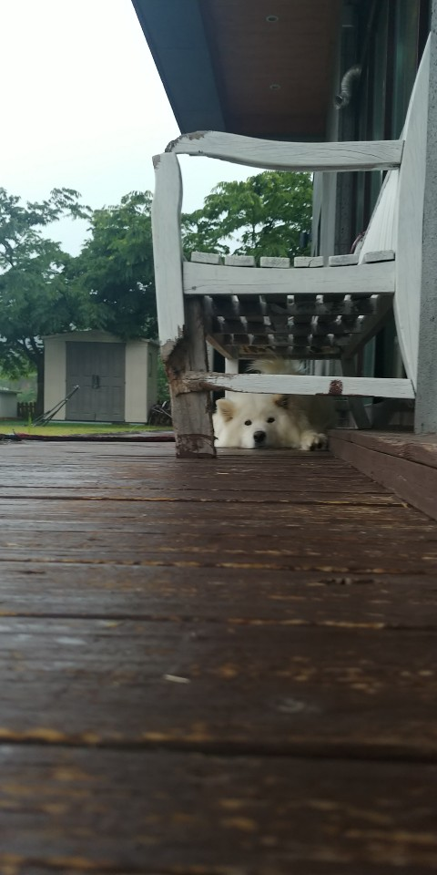
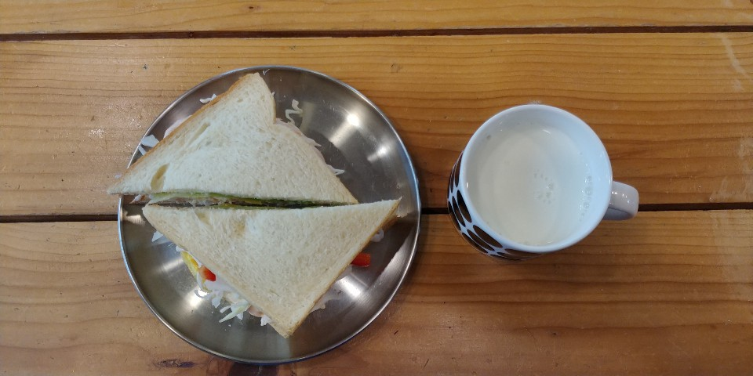

#### 19 . 6.6-6.7

#### 무작정 여행을 떠났다
 

정말 아무런 생각 없이 떠났다.

사실 순례길을 걷고 싶었다.

<h5 style="color:orange;"> 정말 막연한 생각이었다.</h5>

`근데 학기중에 갈 수는 없자나...`

그래서 느낌이라도 내자 싶어서 국내 여기저기를 찾아보기 시작했다.

강원도 해안길 트레킹 , 순천 순례길 , 서울 근교 트레킹, ....  엄청 많다  [^1]

그와중에 지리산 둘레길이 눈에 들어왔다.
나름 인지도가 있었고 숙박, 교통등 편의시설을 굉장히 잘 정리해놓았다.

##### [지리산 둘레길](http://jirisantrail.kr/)

어디로 갈 지 정했으니 여행 코스를 정해야겠지

지리산 둘레길을 검색하니 3코스가 가장 먼저 나오더라

그래서 3코스로 정한 후,  2박 3일 일정을 잡고 3->2->1 코스로 일정을 계획했다. 

##### ~~하지만 취소했다는 건 안비밀~~ [^2]

 

### 대체 난 왜 갔을까?

왜 갔지?

머릿속이 복잡했다.

자세한 이야기는 개인사생활이라 이야기 할 수 없지만 그 당시 머릿속이 정말 너무 복잡했다.

그래서 일상을 떠날 수 밖에 없었다.

그렇지 않았다면 진짜 정신병에 걸릴 것 같았다.

그래서 6월 초에 정말 바빴지만 가기로 결정했다.

그리고 6월 6일 목요일 지리산으로 떠난다.

 

## 트레킹

  

##### 뷰 좋다잉
  

<h3 style="color:orange;"> 시작 </h3>

  

  이때까지만 해도 몰랐쥬

  점심에 함평터미널에 도착했다.

  국밥 한그릇 조지고 기분 좋아져서 나름 힙한척하면서 사진좀 찍었당

그리고 3코스 출발지점으로 도착....!

 

<h3 style="color:orange;"> 트레킹중입니다... </h3>
 

너무 힘들다... 

진짜 너무 힘들다... 

발바닥에는 불이나고 종아리는 뭉치기 시작했고 허벅지는 터질거 같다...[^3]

##### 이때 폴대를 가져오지 않은것을 너무 후회했다.
 

 6시간을 걸었다.

 3시간은 하이킹을 한 것 같다.

 진짜 힘들었다.

##### 사실 이 부분도 적을게 많지만 너무 힘든 기억이라서 길게 적지 않도록 한다.

 

<h3  style="color:orange;">소소게스트하우스 </h3>

 

드디어 숙소에 도착한다.

숙소에서 샤워를 하는데 정말 행복했다.

샤워를 마치고

강아지를 밑으로 내려가서 강아지를 보고 게스트하우스에 살고 있는 아이 둘과 밥을 먹었당

밥을 먹고 방으로 올라왔다. 침대에 누웠는데 이런저런 생각이 들었다. 그만할까? 아니야 처음 계획한대로 2박3일 완주할까? 이런저런 생각이 들었고 고민 끝에 다음날 집으로 돌아가기로 결정한다. 결정후 바로 둘째날 숙소와 마지막날 버스편을 취소하고 다음날 버스편을 예약했다.

  

> 사실 더 있고 싶었고 도전하고 싶기도 했다. 하지만 어쨌든 일상을 무시할 수는 없었다. 당장 개발 프로젝트 발표가 다음주였고,
> 기말고사 기간이었다. 공부와 개발을 빡세게 해야했기 때문에 몸을 너무 혹사해서는 안되겠다고 생각했다.

  

그날밤은 꿀잠을 잤다고 한다.

  

<h3  style="color:orange;">2일차 </h3>

사장님이 만들어주신 아침밥을 먹고 다시 트레킹을 시작한다.

이튿날은 전날의 고생덕분에 어느정도 마음을 먹고 시작했다. 3시간만에 나머지 3코스를 마쳤고 인계터미널에서 `집으로 복귀한드아....`

 

## 후기

  

사실 생각을 정리하려고 간건데 마음먹은 것처럼 쉽게 되지는 않았다. 우선 걷느라 너무 힘들어서 생각할 시간이 많이 없었다.

그래도 한가지 다행인것은 오고가는 버스안에서, 게스트하우스 마당에서, 걷는 중간중간 지리산의 풍경을 보며 마음의 여유를 얻었다.

그래서인지는 몰라도 한동안은 공부와 개발에 집중할 수 있었다.

다음에도 또 올지는 모르겠다. 시간이 된다면 다음에는 산티아고 순례길을 걷고 싶다. 순천 순례길도 걷고싶다. 다음번에는 시간에 쫒겨서 힘들게 걷지 말고 여유롭게 트레킹을 하며 생각할 수 있는 시간을 가지고 싶다.

`아무튼 좋은 추억만 가져갑니다... 총총`

 

[^1]: 트레킹 시장도 나름 레드오션인건가
[^2]: 진짜 너무 힘들었다... 평생 산은 타본적도 없고 맨땅만 터벅이던 판교 촌놈이 갑자기 산을 타려고 하니 온 몸이 다 아파왔다. 
[^3]:사실 3코스 난이도가 힘들다는 것을 미리 알고 갔다. 근데 이렇게 힘들 줄 몰랐쥬...