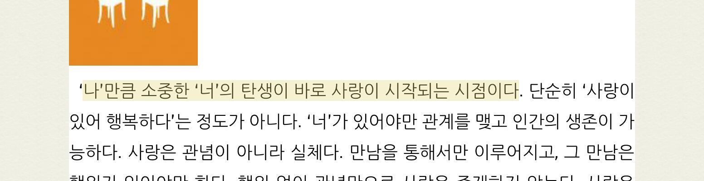
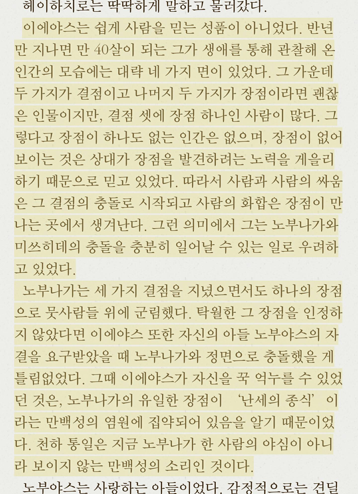

# Overview

## 바야흐로 공유의 시대

집에서 컴퓨터만 쓰던 시절을 지나 언제 어디서든 온라인이 가능한 시대가 되었다. 사시사철 온라인이 가능해짐에 따라 언제 어디서든 디지털 콘텐츠를 공유할 수 있다.

더불어 소셜 미디어의 발달로 ‘공유하기’ 액션 자체도 익숙해졌다. 사용자는 다양한 목적을 갖고 콘텐츠를 공유한다. 운동 기록을 위해 자전거를 탄 총 시간과 경로가 표시된 지도를, 맛집을 추천하기 위해서 음식 사진을 공유한다. 좋아하는 음악 가사에 감동했을 때 이를 기록하기 위해 가사를 공유한다. 인스타그램의 등장 이후로 이런 공유 콘텐츠는 이미지의 형태를 띈다.

공유는 사업적으로도 도움을 준다. 공유는 자연스럽게 제품 홍보로 이어지기 때문이다. 그래서 앞다투어 많은 서비스에서 공유하기 기능을 만들고 보기 좋은 공유 콘텐츠를 생성할 수 있게 설계한다.

이렇듯 공유의 시대인 지금, 물론 리디북스 앱에도 책의 구절을 이미지로 공유할 수 있는 기능이 있었다. 하지만 다소 공유하고 싶은 형태의 콘텐츠는 아니었다.

# Problems

## 1. 단순히 뷰어를 캡쳐한 문장 이미지

기존에는 형광펜이 남겨진 페이지를 시스템에서 자동으로 캡쳐하여 이미지로 생성해 주었다. 그래서 형광펜을 남긴 구절 외에 앞, 뒤의 다른 구절들도 의도와 상관 없이 노출되곤 했다. 또 형광펜 문장을 기준으로 있는 상하좌우 여백도 중구난방이었다.

###### 기존 형광펜 문장 이미지. 형광펜을 남긴 문장 외에도 의도와 상관없이 다른 문장이 함께 이미지로 생성되며 주변 여백도 일정하지 않았다. [^1]

## 2. 이미지 기반 소셜 미디어에 적합하지 않은 공유 이미지

기존 문장 이미지는 따로 정해진 가로와 세로 길이가 없고 문장의 길이에 따라서 달라졌다. 글자 수가 적은 짧은 길이의 문장은 가로가 길고 세로가 짧은 이미지로, 글자 수가 많으면 세로로 긴 이미지가 생성되었다. 그래서 이미지 기반 소셜 미디어에서 공유하기 적합한 비율은 아니었다.

또 단순히 책을 읽는 뷰어를 캡쳐한 이미지라서 뷰어에 설정한 글자 크기로 문장 이미지가 만들어졌다. 그래서 작은 글자 크기로 책을 보면 문장 이미지의 글자 크기도 작기 때문에 가독성이 좋지 않았다. 디자인의 관점에서 봤을 때도 공유하고 싶은 느낌의 이미지는 아니었다.

###### 글자 수가 적을 때 문장 이미지 [^2]

###### 글자 수가 많을 때 공유 이미지[^3]

## 3. 문장 외에 다른 정보가 표시되어 있지 않다.

따로 가공 없이 뷰어를 캡쳐한 이미지이기 때문에 어떤 책에서 나온 문장인지, 저자가 누구인지 알 수 없었다. 당연히 문장 이미지를 보고 리디북스에서 발췌한 문장인지 알 수 없었다.

# Goals

문제점을 바탕으로 아래 세 가지를 만족하는 문장 이미지 만들기를 목표로 했다.

1. 이미지 기반 소셜 미디어에 공유하기 적합한 포맷
2. 자주 공유하고 싶은 멋지고 감성적인 문장 이미지
3. 문장 외에 부가 정보도 보여주는 이미지

# Reference

우선 다른 전자책 서비스는 문장을 어떻게 공유할 수 있는지 살펴봤다. 문장을 이미지로 생성해 주는 서비스라면 그 이미지는 어떤 구조로 되어 있는지, 어떻게 공유할 수 있는지 플로도 함께 조사했다. 전자책 서비스 외에도 문장을 공유할 수 있는 다양한 서비스를 함께 조사했다.

## 전자책 서비스 Kobo, Glose

전자책 서비스 중 문장을 이미지로 공유할 수 있는 서비스는 Kobo와 Glose가 있다. 두 서비스 모두 일종의 편집 모드가 있다. 편집 모드에 진입하면 선택한 문장이 노출되고 배경 이미지, 글꼴을 바꿀 수 있다. 편집을 마친 후 공유 버튼을 누르면 공유 익스텐션이 뜨고 편집을 마친 문장 이미지를 다른 앱에 공유하거나 사진첩에 다운로드할 수 있다.

## Kobo

Kobo는 이미지, 플레인 텍스트 둘 중 하나를 선택해서 공유할 수 있다. 문장 이미지는 정해진 배경이 있고 배경의 컬러만 바꿀 수 있다. 총 4가지 기본 글꼴을 제공한다. 정렬은 왼쪽 정렬을 사용하고 글자 수는 대략 150자를 보여준다. 책 제목과 저자명은 왼쪽 하단에서 보여주고 우측 하단에는 Kobo 로고를 표시했다.

## Glose

Glose는 이미지 공유만 지원한다. 문장 이미지 배경은 Glose에서 제공하는 배경을 사용하거나 커스텀 이미지를 추가할 수 있다. 바로 찍어서 해당 이미지를 사용하거나 내 사진첩에서 가져올 수 있다. 심지어 Unsplash에서 이미지를 가져올 수도 있다. 이미지가 너무 선명해서 문장이 보이지 않을 수도 있다. 그래서 blur 기능도 on/off로 제공한다.

전체적으로 가운데 정렬을 사용하고 Kobo와 마찬가지로 하단에 책 제목과 저자명을, 왼쪽 하단에는 Glose 로고를 표시했다. 큰 따옴표를 위, 아래에 표시하여 인용한다는 느낌을 주었다.

## 음악 가사 공유 앱 Musixmatch

Musixmatch에는 원하는 가사를 'Lyrics Card'로 만드는 기능이 있다. 공유 이미지를 만드는 서비스들 중 제일 다양한 기능을 지원한다. 글자는 글꼴을 변경할 수 있을 뿐 아니라 글자 크기, 정렬까지 변경할 수 있고 글자의 위치도 사용자가 직접 드래그로 움직여 변경할 수 있다. 배경은 제공하는 이미지 외에도 사용자가 직접 추가할 수 있고 배경의 밝기도 조정할 수 있다. 디폴트 배경이 따로 없고 매번 들어갈 때마다 배경 이미지가 변경된다. 다양한 배경을 사용하게끔 하는 디자이너의 넛지인 것 같다. 이미지 필터도 7개나 제공한다. 한 번 선택한 가사를 편집 모드에서 다시 선택할 수 있는 '인용구' 기능도 있다.

# 그 외 다양한 공유 이미지

위에 세 서비스 외에도 이미지 구조 레이아웃을 잡기 위해 다양한 공유 이미지를 살펴봤다. 어떤 이미지 비율을 사용하는지, 서비스 로고는 어떤식으로 노출하는지, 어떤 정렬을 사용하는지, 정보는 어떤식으로 어디에 위치시키는지 등을 조사했다.

###### 왼쪽 위에서부터 medium, uniqday, instapaper, google primer, weread, read

[^1]: 이미지 출처 [페이스북](https://www.facebook.com/photo.php?fbid=10209678295738712&set=a.10209012739420220&type=3&theater)
[^2]: 이미지 출처 [페이스북](https://www.facebook.com/photo.php?fbid=572137429471427&set=a.474644542554050&type=3&theater)
[^3]: 이미지 출처 [페이스북](https://www.facebook.com/photo.php?fbid=764505133679922&set=a.762474363882999&type=3&theater)